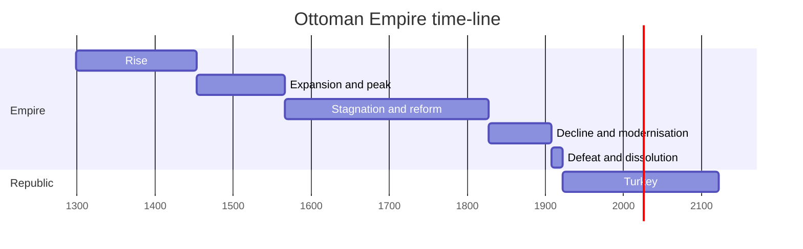

# Ottoman Empire

The *Ottoman Empire*, historically and colloquially known as the *Turkish Empire*, was an imperial realm centered in Anatolia that controlled much of Southeast Europe, West Asia, and North Africa from the 14th to early 20th centuries; it also controlled parts of southeastern Central Europe, between the early 16th and early 18th centuries.