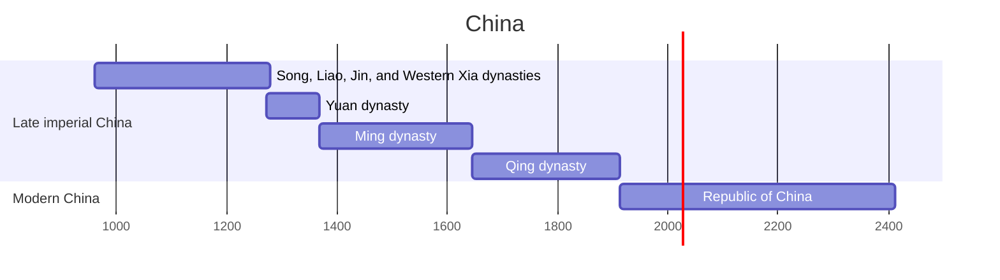

# China: from late imperial to modern

```mermaid
gantt
        title China
        dateFormat  YYYY
		axisFormat	%Y
		section Late imperial China
		Song, Liao, Jin, and Western Xia dynasties	: 0960, 1279
		Yuan dynasty			: 1271, 1368
		Ming dynasty			: 1368, 1644
		Qing dynasty			: 1644, 1912
		section Modern China
		Republic of China		: 1912, 500y
```

https://en.wikipedia.org/wiki/History_of_China
