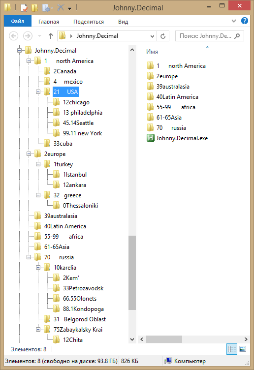
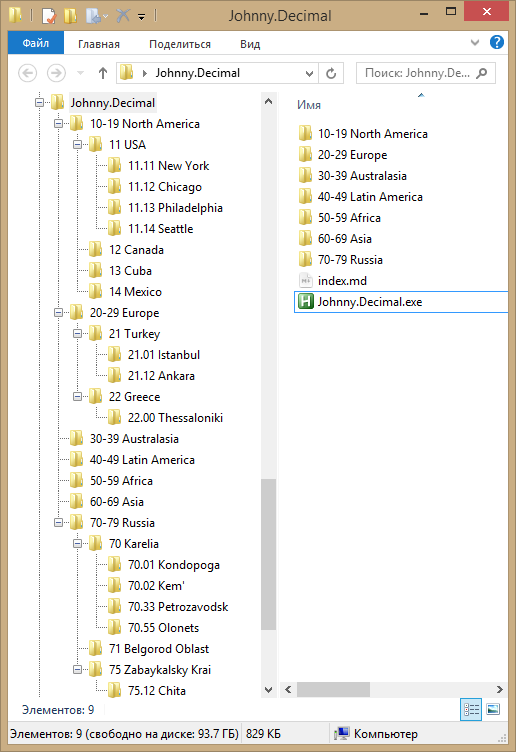
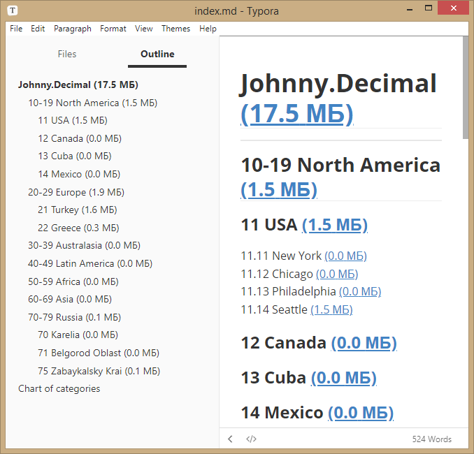
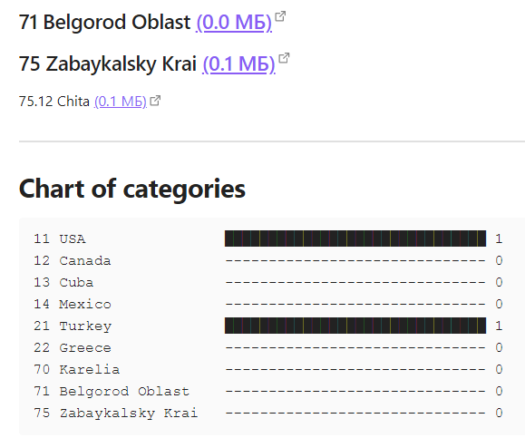

# Johnny.Decimal

___Johnny.Decimal folders' normalization tool___

This application was intended to quickly change folder names according to JD system; a user could easily change names of folders and not keep the correspondence between different folder levels. The application being launched inside the root folder will recover folder name consistency.

## Folders before

## Folders after

## Index file

_**Index.md** will be automatically generated in the root folder or inside **Obsidian Vault** folder in case it persists inside the root one._

## A chart of folders size 

_The **Obsidian** application with **TinyChart** plugin is required to view this chart at the end of index.md._

