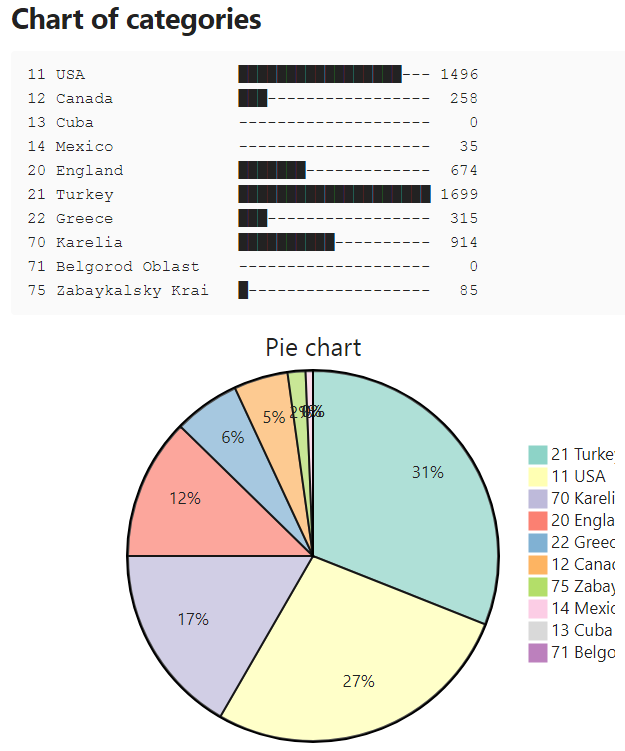

# Johnny.Decimal folders' normalization tool

This application was intended to quickly change a number in the folder names according to JD system; a user could easily change names of folders and not keep the correspondence between different folder levels. The application being launched inside the root folder will recover folder name consistency.

## Folders before

## Folders after

## Index file

**Index.md** will be automatically generated in the root folder or inside **.\Obsidian Vault** subfolder in case it persists inside the root one.

## A chart of folders size

The [Obsidian](https://obsidian.md/) application with [TinyChart](https://github.com/alincoop/obsidian-tinychart) plugin is required to view this chart (MB) at the end of **index.md**.

## A demo video

[The automatically generated index md file for JD structure inside PARA viewed by Obsidian](https://youtu.be/NCQlNadQBzU)
