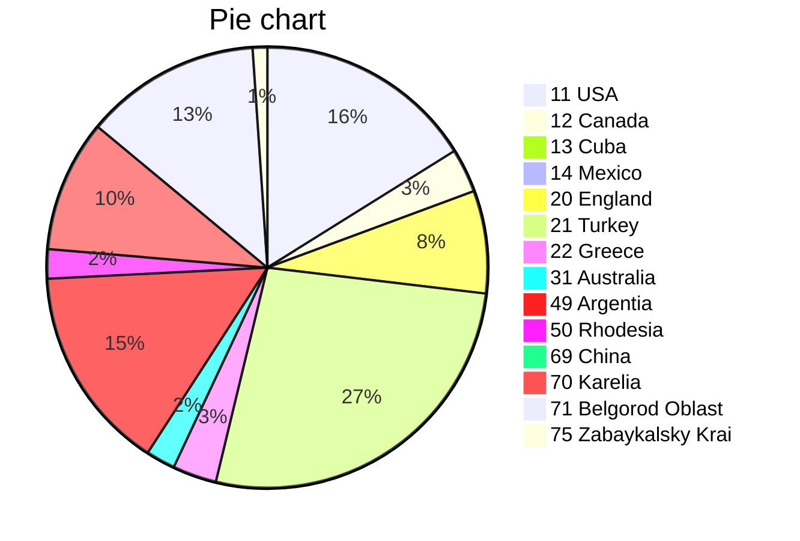
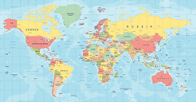

# <span style="color:green">Johnny.Decimal</span> [(27 МБ)](<file:///C:\Users\Evgeny\Documents\AutoHotkey\Johnny.Decimal>) <span style="color:red">A8</span>/<span style="color:blue">C15</span> [[hystory.md|📜]]
---
## 1      north America [(1 МБ)](<file:///C:\Users\Evgeny\Documents\AutoHotkey\Johnny.Decimal\1      north America>)
### 11 USA [(1 МБ)](<file:///C:\Users\Evgeny\Documents\AutoHotkey\Johnny.Decimal\1      north America\11 USA>)
> [!info]- Суть
> [[1      north America/11 USA/11.00/readme|readme>>]]
>The **United States of America** (USA or U.S.A.), commonly known as the United States (US or U.S.) or America, is a country primarily located in North America. It is a federation of 50 states, which also includes its federal capital district of Washington, D.C., and 326 Indian reservations. The 48 contiguous states border Canada to the north and Mexico to the south. The State of Alaska is non-contiguous and lies to the northwest, while the State of Hawaii is an archipelago in the Pacific Ocean. Outside the union of states, the U.S. also asserts sovereignty over five major unincorporated island territories and various uninhabited islands. The country has the world's third-largest land area, second-largest exclusive economic zone, and third-largest population, exceeding 334 million.
>

> [!example]- Склад
11.00 [(0,0 МБ)](<file:///C:\Users\Evgeny\Documents\AutoHotkey\Johnny.Decimal\1      north America\11 USA\11.00>)
*11.10 ■ East Coast*
11.11 New York [(0,0 МБ)](<file:///C:\Users\Evgeny\Documents\AutoHotkey\Johnny.Decimal\1      north America\11 USA\11.11 New York>)
11.12 Chicago [(0,0 МБ)](<file:///C:\Users\Evgeny\Documents\AutoHotkey\Johnny.Decimal\1      north America\11 USA\11.12 Chicago>)
11.13 Philadelphia [(0,0 МБ)](<file:///C:\Users\Evgeny\Documents\AutoHotkey\Johnny.Decimal\1      north America\11 USA\11.13 Philadelphia>)
11.14 Seattle [(1,5 МБ)](<file:///C:\Users\Evgeny\Documents\AutoHotkey\Johnny.Decimal\1      north America\11 USA\11.14 Seattle>)

> [!quote]- Заметки
> [[1      north America/11 USA/11.14 Seattle/views.md|views.md>>]]

### 12 Canada [(0 МБ)](<file:///C:\Users\Evgeny\Documents\AutoHotkey\Johnny.Decimal\1      north America\12 Canada>)
> [!example]- Склад
12.00 Quebec [(0,3 МБ)](<file:///C:\Users\Evgeny\Documents\AutoHotkey\Johnny.Decimal\1      north America\12 Canada\12.00 Quebec>)

> [!quote]- Заметки
> [[1      north America/12 Canada/12.00 Quebec/readme.md|readme.md>>]]

### 13 Cuba [(0 МБ)](<file:///C:\Users\Evgeny\Documents\AutoHotkey\Johnny.Decimal\1      north America\13 Cuba>)
> [!tip]- Вид
&nbsp;&nbsp;

> [!example]- Склад
13.00 [(0,0 МБ)](<file:///C:\Users\Evgeny\Documents\AutoHotkey\Johnny.Decimal\1      north America\13 Cuba\13.00>)

### 14 Mexico [(0 МБ)](<file:///C:\Users\Evgeny\Documents\AutoHotkey\Johnny.Decimal\1      north America\14 Mexico>)
> [!example]- Склад
14.01 Teotihuacan [(0,0 МБ)](<file:///C:\Users\Evgeny\Documents\AutoHotkey\Johnny.Decimal\1      north America\14 Mexico\14.01 Teotihuacan>)

> [!quote]- Заметки
> [[1      north America/14 Mexico/14.01 Teotihuacan/Etymology.md|Etymology.md>>]]

---
## 10-19 North America [(0 МБ)](<file:///C:\Users\Evgeny\Documents\AutoHotkey\Johnny.Decimal\10-19 North America>)
### 14 Mexico [(0 МБ)](<file:///C:\Users\Evgeny\Documents\AutoHotkey\Johnny.Decimal\10-19 North America\14 Mexico>)
> [!example]- Склад
14.01 Teotihuacan [(0,0 МБ)](<file:///C:\Users\Evgeny\Documents\AutoHotkey\Johnny.Decimal\10-19 North America\14 Mexico\14.01 Teotihuacan>)

---
## 20-29 Europe [(3 МБ)](<file:///C:\Users\Evgeny\Documents\AutoHotkey\Johnny.Decimal\20-29 Europe>)
### 20 England [(0 МБ)](<file:///C:\Users\Evgeny\Documents\AutoHotkey\Johnny.Decimal\20-29 Europe\20 England>)
> [!example]- Склад
20.15 Bristol [(0,7 МБ)](<file:///C:\Users\Evgeny\Documents\AutoHotkey\Johnny.Decimal\20-29 Europe\20 England\20.15 Bristol>)

> [!quote]- Заметки
> [[20-29 Europe/20 England/20.15 Bristol/15 марта 1898 года.md|15 марта 1898 года.md>>]]

### 21 Turkey [(2 МБ)](<file:///C:\Users\Evgeny\Documents\AutoHotkey\Johnny.Decimal\20-29 Europe\21 Turkey>)
> [!tip]- Вид
&nbsp;&nbsp;

> [!info]- Суть
> [[20-29 Europe/21 Turkey/21.00/readme|readme>>]]
># Türkiye
>
>**Türkiye**, resmî adıyla ***Türkiye Cumhuriyeti***, topraklarının büyük bölümü Batı Asya'da Anadolu'da, diğer bir bölümü ise Güneydoğu Avrupa'nın uzantısı Doğu Trakya'da olan kıtalararası bir ülkedir. Batıda Bulgaristan ve Yunanistan, doğuda Gürcistan, Ermenistan, İran ve Azerbaycan, güneyde ise Irak ve Suriye ile sınır komşusudur. Güneyini Kıbrıs ve Akdeniz, batısını Ege Denizi, kuzeyini ise Karadeniz çevreler. Marmara Denizi ise İstanbul Boğazı ve Çanakkale Boğazı ile birlikte Anadolu'yu Trakya'dan, yani Asya'yı Avrupa'dan ayırır. Resmî olarak laik bir devlet olan Türkiye'de nüfusun çoğunluğu Müslüman'dır. Ankara, Türkiye'nin başkenti ve ikinci büyük şehridir. İstanbul ise, Türkiye'nin en büyük şehri, ekonomik merkezi ve aynı zamanda Avrupa'nın en büyük şehridir.
>

> [!danger]- Время
> [[20-29 Europe/21 Turkey/21.00/tempus|tempus>>]]
># Ottoman Empire
>
>```mermaid
>gantt
>        title Ottoman Empire time-line
>        dateFormat  YYYY
>		axisFormat	%Y
>        section Empire
>        Rise						:a1, 1299, 1453
>        Expansion and peak			:a2, after a1, 1566
>		Stagnation and reform		:a3, after a2, 1827
>		Decline and modernisation	:a4, after a3, 1908
>		Defeat and dissolution		:a5, after a4, 1922
>        section Republic
>        Turkey						:after a5, 200y
>```

> [!example]- Склад
21.00 [(0,0 МБ)](<file:///C:\Users\Evgeny\Documents\AutoHotkey\Johnny.Decimal\20-29 Europe\21 Turkey\21.00>)
21.01 Istanbul [(1,3 МБ)](<file:///C:\Users\Evgeny\Documents\AutoHotkey\Johnny.Decimal\20-29 Europe\21 Turkey\21.01 Istanbul>)
21.12 Ankara [(0,4 МБ)](<file:///C:\Users\Evgeny\Documents\AutoHotkey\Johnny.Decimal\20-29 Europe\21 Turkey\21.12 Ankara>)
21.20 Trabzon [(0,8 МБ)](<file:///C:\Users\Evgeny\Documents\AutoHotkey\Johnny.Decimal\20-29 Europe\21 Turkey\21.20 Trabzon>)

### 22 Greece [(0 МБ)](<file:///C:\Users\Evgeny\Documents\AutoHotkey\Johnny.Decimal\20-29 Europe\22 Greece>)
> [!example]- Склад
22.00 Thessaloniki [(0,3 МБ)](<file:///C:\Users\Evgeny\Documents\AutoHotkey\Johnny.Decimal\20-29 Europe\22 Greece\22.00 Thessaloniki>)

> [!quote]- Заметки
> [[20-29 Europe/22 Greece/22.00 Thessaloniki/views.md|views.md>>]]

---
## 30-39 Australasia [(0 МБ)](<file:///C:\Users\Evgeny\Documents\AutoHotkey\Johnny.Decimal\30-39 Australasia>)
### 31 Australia [(0 МБ)](<file:///C:\Users\Evgeny\Documents\AutoHotkey\Johnny.Decimal\30-39 Australasia\31 Australia>)
> [!tip]- Вид
.jpg>)&nbsp;

> [!example]- Склад
31.00 [(0,2 МБ)](<file:///C:\Users\Evgeny\Documents\AutoHotkey\Johnny.Decimal\30-39 Australasia\31 Australia\31.00>)

---
## 40-49 Latin America [(1 МБ)](<file:///C:\Users\Evgeny\Documents\AutoHotkey\Johnny.Decimal\40-49 Latin America>)
### 49 Argentia [(1 МБ)](<file:///C:\Users\Evgeny\Documents\AutoHotkey\Johnny.Decimal\40-49 Latin America\49 Argentia>)
> [!example]- Склад
49.11 Buenos Aires [(1,4 МБ)](<file:///C:\Users\Evgeny\Documents\AutoHotkey\Johnny.Decimal\40-49 Latin America\49 Argentia\49.11 Buenos Aires>)

---
## 50-59 Africa [(0 МБ)](<file:///C:\Users\Evgeny\Documents\AutoHotkey\Johnny.Decimal\50-59 Africa>)
### 50 Rhodesia [(0 МБ)](<file:///C:\Users\Evgeny\Documents\AutoHotkey\Johnny.Decimal\50-59 Africa\50 Rhodesia>)
> [!tip]- Вид
.svg.png>)&nbsp;.svg.png>)&nbsp;

> [!example]- Склад
50.00 [(0,0 МБ)](<file:///C:\Users\Evgeny\Documents\AutoHotkey\Johnny.Decimal\50-59 Africa\50 Rhodesia\50.00>)
50.11 Salisbury [(0,2 МБ)](<file:///C:\Users\Evgeny\Documents\AutoHotkey\Johnny.Decimal\50-59 Africa\50 Rhodesia\50.11 Salisbury>)

---
## 60-69 Asia [(0 МБ)](<file:///C:\Users\Evgeny\Documents\AutoHotkey\Johnny.Decimal\60-69 Asia>)
### 69 China [(0 МБ)](<file:///C:\Users\Evgeny\Documents\AutoHotkey\Johnny.Decimal\60-69 Asia\69 China>)
> [!abstract]- Облако
> [[60-69 Asia/69 China/69.00/nimbus|nimbus>>]]
># Cloud storage
>
>https://drive.google.com/
>https://www.dropbox.com/
>https://mega.nz/
>

> [!danger]- Время
> [[60-69 Asia/69 China/69.00/tempus|tempus>>]]
># China: from late imperial to modern
>
>```mermaid
>gantt
>        title China
>        dateFormat  YYYY
>		axisFormat	%Y
>		section Late imperial China
>		Song, Liao, Jin, and Western Xia dynasties	: 0960, 1279
>		Yuan dynasty			: 1271, 1368
>		Ming dynasty			: 1368, 1644
>		Qing dynasty			: 1644, 1912
>		section Modern China
>		Republic of China		: 1912, 500y
>```

> [!example]- Склад
69.00 [(0,0 МБ)](<file:///C:\Users\Evgeny\Documents\AutoHotkey\Johnny.Decimal\60-69 Asia\69 China\69.00>)

---
## 70-79 Russia [(2 МБ)](<file:///C:\Users\Evgeny\Documents\AutoHotkey\Johnny.Decimal\70-79 Russia>)
### 70 Karelia [(0 МБ)](<file:///C:\Users\Evgeny\Documents\AutoHotkey\Johnny.Decimal\70-79 Russia\70 Karelia>)
> [!example]- Склад
70.01 Kondopoga [(0,0 МБ)](<file:///C:\Users\Evgeny\Documents\AutoHotkey\Johnny.Decimal\70-79 Russia\70 Karelia\70.01 Kondopoga>)
70.02 Kem' [(0,9 МБ)](<file:///C:\Users\Evgeny\Documents\AutoHotkey\Johnny.Decimal\70-79 Russia\70 Karelia\70.02 Kem'>)
70.33 Petrozavodsk [(0,0 МБ)](<file:///C:\Users\Evgeny\Documents\AutoHotkey\Johnny.Decimal\70-79 Russia\70 Karelia\70.33 Petrozavodsk>)
70.55 Olonets [(0,0 МБ)](<file:///C:\Users\Evgeny\Documents\AutoHotkey\Johnny.Decimal\70-79 Russia\70 Karelia\70.55 Olonets>)

### 71 Belgorod Oblast [(1 МБ)](<file:///C:\Users\Evgeny\Documents\AutoHotkey\Johnny.Decimal\70-79 Russia\71 Belgorod Oblast>)
> [!example]- Склад
71.10 Belgorod [(0,5 МБ)](<file:///C:\Users\Evgeny\Documents\AutoHotkey\Johnny.Decimal\70-79 Russia\71 Belgorod Oblast\71.10 Belgorod>)
71.20 Stary Oskol [(0,7 МБ)](<file:///C:\Users\Evgeny\Documents\AutoHotkey\Johnny.Decimal\70-79 Russia\71 Belgorod Oblast\71.20 Stary Oskol>)

### 75 Zabaykalsky Krai [(0 МБ)](<file:///C:\Users\Evgeny\Documents\AutoHotkey\Johnny.Decimal\70-79 Russia\75 Zabaykalsky Krai>)
> [!example]- Склад
75.12 Chita [(0,1 МБ)](<file:///C:\Users\Evgeny\Documents\AutoHotkey\Johnny.Decimal\70-79 Russia\75 Zabaykalsky Krai\75.12 Chita>)


---

# Chart of categories
```tinychart
11 USA, 1
12 Canada, 0
13 Cuba, 0
14 Mexico, 0
14 Mexico, 0
20 England, 0
21 Turkey, 2
22 Greece, 0
31 Australia, 0
49 Argentia, 1
50 Rhodesia, 0
69 China, 0
70 Karelia, 0
71 Belgorod Oblast, 1
75 Zabaykalsky Krai, 0
```



---


*Файл создан в день 356 во время 00:52 за 6 сек. / Evgeny@HOME-PC!WIN_8.1*
