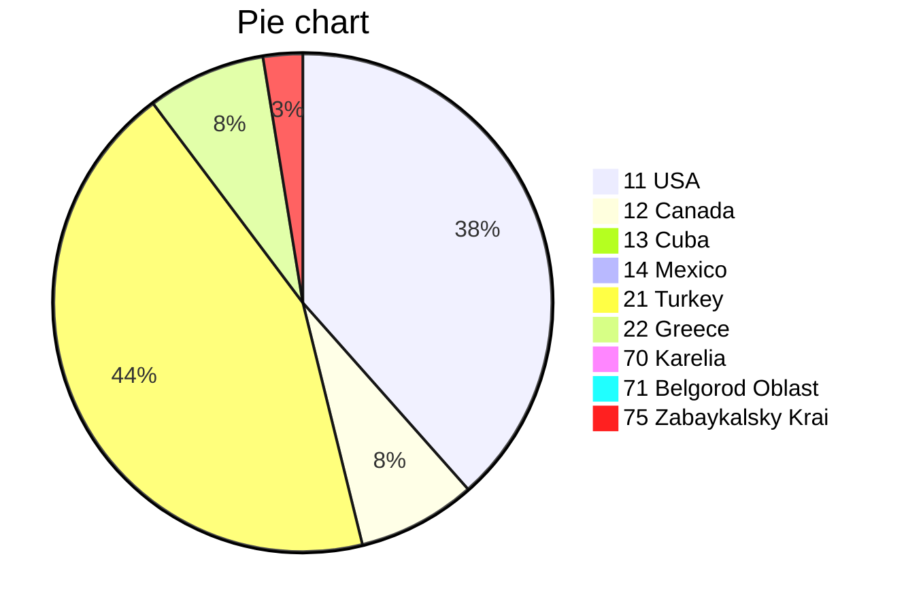

# <span style="color:green">Johnny.Decimal</span> [(26&nbsp;МБ)](<file:///C:\Users\Evgeny\Documents\AutoHotkey\Johnny.Decimal>) <span style="color:red">A7</span>/<span style="color:blue">C9</span>
---
## 10-19 North America [(1&nbsp;МБ)](<file:///C:\Users\Evgeny\Documents\AutoHotkey\Johnny.Decimal\10-19 North America>)
### 11 USA [(1&nbsp;МБ)](<file:///C:\Users\Evgeny\Documents\AutoHotkey\Johnny.Decimal\10-19 North America\11 USA>)
> [!example]- Склад
11.11 New York [(0,0&nbsp;МБ)](<file:///C:\Users\Evgeny\Documents\AutoHotkey\Johnny.Decimal\10-19 North America\11 USA\11.11 New York>)
11.12 Chicago [(0,0&nbsp;МБ)](<file:///C:\Users\Evgeny\Documents\AutoHotkey\Johnny.Decimal\10-19 North America\11 USA\11.12 Chicago>)
11.13 Philadelphia [(0,0&nbsp;МБ)](<file:///C:\Users\Evgeny\Documents\AutoHotkey\Johnny.Decimal\10-19 North America\11 USA\11.13 Philadelphia>)
11.14 Seattle [(1,5&nbsp;МБ)](<file:///C:\Users\Evgeny\Documents\AutoHotkey\Johnny.Decimal\10-19 North America\11 USA\11.14 Seattle>)

### 12 Canada [(0&nbsp;МБ)](<file:///C:\Users\Evgeny\Documents\AutoHotkey\Johnny.Decimal\10-19 North America\12 Canada>)
> [!example]- Склад
12.00 Quebec [(0,3&nbsp;МБ)](<file:///C:\Users\Evgeny\Documents\AutoHotkey\Johnny.Decimal\10-19 North America\12 Canada\12.00 Quebec>)

### 13 Cuba [(0&nbsp;МБ)](<file:///C:\Users\Evgeny\Documents\AutoHotkey\Johnny.Decimal\10-19 North America\13 Cuba>)
### 14 Mexico [(0&nbsp;МБ)](<file:///C:\Users\Evgeny\Documents\AutoHotkey\Johnny.Decimal\10-19 North America\14 Mexico>)
---
## 20-29 Europe [(1&nbsp;МБ)](<file:///C:\Users\Evgeny\Documents\AutoHotkey\Johnny.Decimal\20-29 Europe>)
### 21 Turkey [(1&nbsp;МБ)](<file:///C:\Users\Evgeny\Documents\AutoHotkey\Johnny.Decimal\20-29 Europe\21 Turkey>)
> [!tip]- Вид
&nbsp;&nbsp;

> [!info]- Суть
> [[20-29 Europe/21 Turkey/21.00/readme|readme>>]]
># Türkiye
>
>**Türkiye**, resmî adıyla ***Türkiye Cumhuriyeti***, topraklarının büyük bölümü Batı Asya'da Anadolu'da, diğer bir bölümü ise Güneydoğu Avrupa'nın uzantısı Doğu Trakya'da olan kıtalararası bir ülkedir. Batıda Bulgaristan ve Yunanistan, doğuda Gürcistan, Ermenistan, İran ve Azerbaycan, güneyde ise Irak ve Suriye ile sınır komşusudur. Güneyini Kıbrıs ve Akdeniz, batısını Ege Denizi, kuzeyini ise Karadeniz çevreler. Marmara Denizi ise İstanbul Boğazı ve Çanakkale Boğazı ile birlikte Anadolu'yu Trakya'dan, yani Asya'yı Avrupa'dan ayırır. Resmî olarak laik bir devlet olan Türkiye'de nüfusun çoğunluğu Müslüman'dır. Ankara, Türkiye'nin başkenti ve ikinci büyük şehridir. İstanbul ise, Türkiye'nin en büyük şehri, ekonomik merkezi ve aynı zamanda Avrupa'nın en büyük şehridir.
>

> [!danger]- Время
> [[20-29 Europe/21 Turkey/21.00/tempus|tempus>>]]
># Ottoman Empire
>
>```mermaid
>gantt
>        title Ottoman Empire time-line
>        dateFormat  YYYY
>        section Empire
>        Rise						:a1, 1299, 1453
>        Expansion and peak			:a2, after a1, 1566
>		Stagnation and reform		:a3, after a2, 1827
>		Decline and modernisation	:a4, after a3, 1908
>		Defeat and dissolution		:a5, after a4, 1922
>        section Republic
>        Turkey						:after a5, 200y
>```

> [!example]- Склад
21.00 [(0,0&nbsp;МБ)](<file:///C:\Users\Evgeny\Documents\AutoHotkey\Johnny.Decimal\20-29 Europe\21 Turkey\21.00>)
21.01 Istanbul [(1,3&nbsp;МБ)](<file:///C:\Users\Evgeny\Documents\AutoHotkey\Johnny.Decimal\20-29 Europe\21 Turkey\21.01 Istanbul>)
21.12 Ankara [(0,4&nbsp;МБ)](<file:///C:\Users\Evgeny\Documents\AutoHotkey\Johnny.Decimal\20-29 Europe\21 Turkey\21.12 Ankara>)

### 22 Greece [(0&nbsp;МБ)](<file:///C:\Users\Evgeny\Documents\AutoHotkey\Johnny.Decimal\20-29 Europe\22 Greece>)
> [!example]- Склад
22.00 Thessaloniki [(0,3&nbsp;МБ)](<file:///C:\Users\Evgeny\Documents\AutoHotkey\Johnny.Decimal\20-29 Europe\22 Greece\22.00 Thessaloniki>)

---
## 30-39 Australasia [(0&nbsp;МБ)](<file:///C:\Users\Evgeny\Documents\AutoHotkey\Johnny.Decimal\30-39 Australasia>)
---
## 40-49 Latin America [(0&nbsp;МБ)](<file:///C:\Users\Evgeny\Documents\AutoHotkey\Johnny.Decimal\40-49 Latin America>)
---
## 50-59 Africa [(0&nbsp;МБ)](<file:///C:\Users\Evgeny\Documents\AutoHotkey\Johnny.Decimal\50-59 Africa>)
---
## 60-69 Asia [(0&nbsp;МБ)](<file:///C:\Users\Evgeny\Documents\AutoHotkey\Johnny.Decimal\60-69 Asia>)
---
## 70-79 Russia [(0&nbsp;МБ)](<file:///C:\Users\Evgeny\Documents\AutoHotkey\Johnny.Decimal\70-79 Russia>)
### 70 Karelia [(0&nbsp;МБ)](<file:///C:\Users\Evgeny\Documents\AutoHotkey\Johnny.Decimal\70-79 Russia\70 Karelia>)
> [!example]- Склад
70.01 Kondopoga [(0,0&nbsp;МБ)](<file:///C:\Users\Evgeny\Documents\AutoHotkey\Johnny.Decimal\70-79 Russia\70 Karelia\70.01 Kondopoga>)
70.02 Kem' [(0,0&nbsp;МБ)](<file:///C:\Users\Evgeny\Documents\AutoHotkey\Johnny.Decimal\70-79 Russia\70 Karelia\70.02 Kem'>)
70.33 Petrozavodsk [(0,0&nbsp;МБ)](<file:///C:\Users\Evgeny\Documents\AutoHotkey\Johnny.Decimal\70-79 Russia\70 Karelia\70.33 Petrozavodsk>)
70.55 Olonets [(0,0&nbsp;МБ)](<file:///C:\Users\Evgeny\Documents\AutoHotkey\Johnny.Decimal\70-79 Russia\70 Karelia\70.55 Olonets>)

### 71 Belgorod Oblast [(0&nbsp;МБ)](<file:///C:\Users\Evgeny\Documents\AutoHotkey\Johnny.Decimal\70-79 Russia\71 Belgorod Oblast>)
### 75 Zabaykalsky Krai [(0&nbsp;МБ)](<file:///C:\Users\Evgeny\Documents\AutoHotkey\Johnny.Decimal\70-79 Russia\75 Zabaykalsky Krai>)
> [!example]- Склад
75.12 Chita [(0,1&nbsp;МБ)](<file:///C:\Users\Evgeny\Documents\AutoHotkey\Johnny.Decimal\70-79 Russia\75 Zabaykalsky Krai\75.12 Chita>)


---

# Chart of categories
```tinychart
11 USA, 1
12 Canada, 0
13 Cuba, 0
14 Mexico, 0
21 Turkey, 1
22 Greece, 0
70 Karelia, 0
71 Belgorod Oblast, 0
75 Zabaykalsky Krai, 0
```



---

