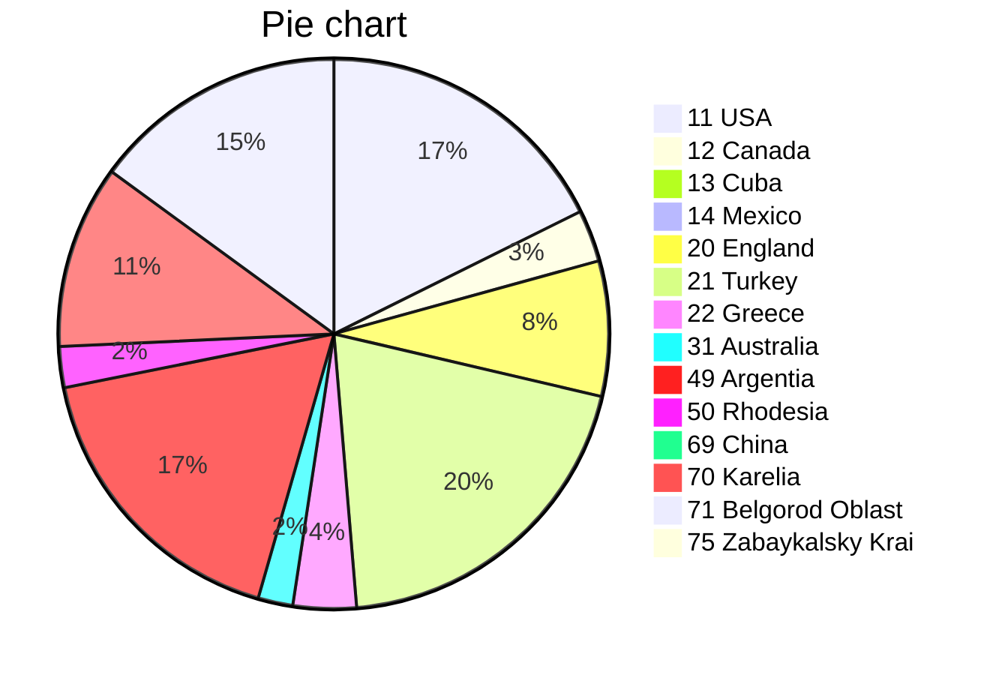

# <span style="color:green">Johnny.Decimal</span> [(26'889&nbsp;KB)](<file:///C:\Users\Evgeny\Documents\AutoHotkey\Johnny.Decimal>) <span style="color:red">A7</span>/<span style="color:blue">C14</span>
---
## 10-19 North America [(1'808&nbsp;KB)](<file:///C:\Users\Evgeny\Documents\AutoHotkey\Johnny.Decimal\10-19 North America>)
### 11 USA [(1'500&nbsp;KB)](<file:///C:\Users\Evgeny\Documents\AutoHotkey\Johnny.Decimal\10-19 North America\11 USA>)
> [!info]- Point
> [[10-19 North America/11 USA/11.00/readme|readme>>]]
>The **United States of America** (USA or U.S.A.), commonly known as the United States (US or U.S.) or America, is a country primarily located in North America. It is a federation of 50 states, which also includes its federal capital district of Washington, D.C., and 326 Indian reservations. The 48 contiguous states border Canada to the north and Mexico to the south. The State of Alaska is non-contiguous and lies to the northwest, while the State of Hawaii is an archipelago in the Pacific Ocean. Outside the union of states, the U.S. also asserts sovereignty over five major unincorporated island territories and various uninhabited islands. The country has the world's third-largest land area, second-largest exclusive economic zone, and third-largest population, exceeding 334 million.
>

> [!example]- Store
11.00 [(3.3&nbsp;KB)](<file:///C:\Users\Evgeny\Documents\AutoHotkey\Johnny.Decimal\10-19 North America\11 USA\11.00>)
11.11 New York [(0.0&nbsp;KB)](<file:///C:\Users\Evgeny\Documents\AutoHotkey\Johnny.Decimal\10-19 North America\11 USA\11.11 New York>)
11.12 Chicago [(0.0&nbsp;KB)](<file:///C:\Users\Evgeny\Documents\AutoHotkey\Johnny.Decimal\10-19 North America\11 USA\11.12 Chicago>)
11.13 Philadelphia [(0.0&nbsp;KB)](<file:///C:\Users\Evgeny\Documents\AutoHotkey\Johnny.Decimal\10-19 North America\11 USA\11.13 Philadelphia>)
11.14 Seattle [(1'496.9&nbsp;KB)](<file:///C:\Users\Evgeny\Documents\AutoHotkey\Johnny.Decimal\10-19 North America\11 USA\11.14 Seattle>)

### 12 Canada [(258&nbsp;KB)](<file:///C:\Users\Evgeny\Documents\AutoHotkey\Johnny.Decimal\10-19 North America\12 Canada>)
> [!example]- Store
12.00 Quebec [(258.7&nbsp;KB)](<file:///C:\Users\Evgeny\Documents\AutoHotkey\Johnny.Decimal\10-19 North America\12 Canada\12.00 Quebec>)

### 13 Cuba [(14&nbsp;KB)](<file:///C:\Users\Evgeny\Documents\AutoHotkey\Johnny.Decimal\10-19 North America\13 Cuba>)
> [!tip]- Look
&nbsp;&nbsp;

> [!example]- Store
13.00 [(14.8&nbsp;KB)](<file:///C:\Users\Evgeny\Documents\AutoHotkey\Johnny.Decimal\10-19 North America\13 Cuba\13.00>)

### 14 Mexico [(35&nbsp;KB)](<file:///C:\Users\Evgeny\Documents\AutoHotkey\Johnny.Decimal\10-19 North America\14 Mexico>)
> [!example]- Store
14.01 Teotihuacan [(35.2&nbsp;KB)](<file:///C:\Users\Evgeny\Documents\AutoHotkey\Johnny.Decimal\10-19 North America\14 Mexico\14.01 Teotihuacan>)

---
## 20-29 Europe [(2'690&nbsp;KB)](<file:///C:\Users\Evgeny\Documents\AutoHotkey\Johnny.Decimal\20-29 Europe>)
### 20 England [(674&nbsp;KB)](<file:///C:\Users\Evgeny\Documents\AutoHotkey\Johnny.Decimal\20-29 Europe\20 England>)
> [!example]- Store
20.15 Bristol [(674.6&nbsp;KB)](<file:///C:\Users\Evgeny\Documents\AutoHotkey\Johnny.Decimal\20-29 Europe\20 England\20.15 Bristol>)

### 21 Turkey [(1'699&nbsp;KB)](<file:///C:\Users\Evgeny\Documents\AutoHotkey\Johnny.Decimal\20-29 Europe\21 Turkey>)
> [!tip]- Look
&nbsp;&nbsp;

> [!info]- Point
> [[20-29 Europe/21 Turkey/21.00/readme|readme>>]]
># Türkiye
>
>**Türkiye**, resmî adıyla ***Türkiye Cumhuriyeti***, topraklarının büyük bölümü Batı Asya'da Anadolu'da, diğer bir bölümü ise Güneydoğu Avrupa'nın uzantısı Doğu Trakya'da olan kıtalararası bir ülkedir. Batıda Bulgaristan ve Yunanistan, doğuda Gürcistan, Ermenistan, İran ve Azerbaycan, güneyde ise Irak ve Suriye ile sınır komşusudur. Güneyini Kıbrıs ve Akdeniz, batısını Ege Denizi, kuzeyini ise Karadeniz çevreler. Marmara Denizi ise İstanbul Boğazı ve Çanakkale Boğazı ile birlikte Anadolu'yu Trakya'dan, yani Asya'yı Avrupa'dan ayırır. Resmî olarak laik bir devlet olan Türkiye'de nüfusun çoğunluğu Müslüman'dır. Ankara, Türkiye'nin başkenti ve ikinci büyük şehridir. İstanbul ise, Türkiye'nin en büyük şehri, ekonomik merkezi ve aynı zamanda Avrupa'nın en büyük şehridir.
>

> [!danger]- Time
> [[20-29 Europe/21 Turkey/21.00/tempus|tempus>>]]
># Ottoman Empire
>
>```mermaid
>gantt
>        title Ottoman Empire time-line
>        dateFormat  YYYY
>		axisFormat	%Y
>        section Empire
>        Rise						:a1, 1299, 1453
>        Expansion and peak			:a2, after a1, 1566
>		Stagnation and reform		:a3, after a2, 1827
>		Decline and modernisation	:a4, after a3, 1908
>		Defeat and dissolution		:a5, after a4, 1922
>        section Republic
>        Turkey						:after a5, 200y
>```

> [!example]- Store
21.00 [(9.3&nbsp;KB)](<file:///C:\Users\Evgeny\Documents\AutoHotkey\Johnny.Decimal\20-29 Europe\21 Turkey\21.00>)
21.01 Istanbul [(1'305.9&nbsp;KB)](<file:///C:\Users\Evgeny\Documents\AutoHotkey\Johnny.Decimal\20-29 Europe\21 Turkey\21.01 Istanbul>)
21.12 Ankara [(384.6&nbsp;KB)](<file:///C:\Users\Evgeny\Documents\AutoHotkey\Johnny.Decimal\20-29 Europe\21 Turkey\21.12 Ankara>)

### 22 Greece [(315&nbsp;KB)](<file:///C:\Users\Evgeny\Documents\AutoHotkey\Johnny.Decimal\20-29 Europe\22 Greece>)
> [!example]- Store
22.00 Thessaloniki [(315.6&nbsp;KB)](<file:///C:\Users\Evgeny\Documents\AutoHotkey\Johnny.Decimal\20-29 Europe\22 Greece\22.00 Thessaloniki>)

---
## 30-39 Australasia [(173&nbsp;KB)](<file:///C:\Users\Evgeny\Documents\AutoHotkey\Johnny.Decimal\30-39 Australasia>)
### 31 Australia [(173&nbsp;KB)](<file:///C:\Users\Evgeny\Documents\AutoHotkey\Johnny.Decimal\30-39 Australasia\31 Australia>)
> [!tip]- Look
.jpg>)&nbsp;

> [!example]- Store
31.00 [(173.8&nbsp;KB)](<file:///C:\Users\Evgeny\Documents\AutoHotkey\Johnny.Decimal\30-39 Australasia\31 Australia\31.00>)

---
## 40-49 Latin America [(1'478&nbsp;KB)](<file:///C:\Users\Evgeny\Documents\AutoHotkey\Johnny.Decimal\40-49 Latin America>)
### 49 Argentia [(1'478&nbsp;KB)](<file:///C:\Users\Evgeny\Documents\AutoHotkey\Johnny.Decimal\40-49 Latin America\49 Argentia>)
> [!example]- Store
49.11 Buenos Aires [(1'478.9&nbsp;KB)](<file:///C:\Users\Evgeny\Documents\AutoHotkey\Johnny.Decimal\40-49 Latin America\49 Argentia\49.11 Buenos Aires>)

---
## 50-59 Africa [(204&nbsp;KB)](<file:///C:\Users\Evgeny\Documents\AutoHotkey\Johnny.Decimal\50-59 Africa>)
### 50 Rhodesia [(204&nbsp;KB)](<file:///C:\Users\Evgeny\Documents\AutoHotkey\Johnny.Decimal\50-59 Africa\50 Rhodesia>)
> [!tip]- Look
.svg.png>)&nbsp;.svg.png>)&nbsp;

> [!example]- Store
50.00 [(22.4&nbsp;KB)](<file:///C:\Users\Evgeny\Documents\AutoHotkey\Johnny.Decimal\50-59 Africa\50 Rhodesia\50.00>)
50.11 Salisbury [(182.0&nbsp;KB)](<file:///C:\Users\Evgeny\Documents\AutoHotkey\Johnny.Decimal\50-59 Africa\50 Rhodesia\50.11 Salisbury>)

---
## 60-69 Asia [(0&nbsp;KB)](<file:///C:\Users\Evgeny\Documents\AutoHotkey\Johnny.Decimal\60-69 Asia>)
### 69 China [(0&nbsp;KB)](<file:///C:\Users\Evgeny\Documents\AutoHotkey\Johnny.Decimal\60-69 Asia\69 China>)
> [!abstract]- Cloud
> [[60-69 Asia/69 China/69.00/nimbus|nimbus>>]]
># Cloud storage
>
>https://drive.google.com/
>https://www.dropbox.com/
>https://mega.nz/
>

> [!danger]- Time
> [[60-69 Asia/69 China/69.00/tempus|tempus>>]]
># China: from late imperial to modern
>
>```mermaid
>gantt
>        title China
>        dateFormat  YYYY
>		axisFormat	%Y
>		section Late imperial China
>		Song, Liao, Jin, and Western Xia dynasties	: 0960, 1279
>		Yuan dynasty			: 1271, 1368
>		Ming dynasty			: 1368, 1644
>		Qing dynasty			: 1644, 1912
>		section Modern China
>		Republic of China		: 1912, 500y
>```

> [!example]- Store
69.00 [(0.6&nbsp;KB)](<file:///C:\Users\Evgeny\Documents\AutoHotkey\Johnny.Decimal\60-69 Asia\69 China\69.00>)

---
## 70-79 Russia [(2'270&nbsp;KB)](<file:///C:\Users\Evgeny\Documents\AutoHotkey\Johnny.Decimal\70-79 Russia>)
### 70 Karelia [(914&nbsp;KB)](<file:///C:\Users\Evgeny\Documents\AutoHotkey\Johnny.Decimal\70-79 Russia\70 Karelia>)
> [!example]- Store
70.01 Kondopoga [(0.0&nbsp;KB)](<file:///C:\Users\Evgeny\Documents\AutoHotkey\Johnny.Decimal\70-79 Russia\70 Karelia\70.01 Kondopoga>)
70.02 Kem' [(914.4&nbsp;KB)](<file:///C:\Users\Evgeny\Documents\AutoHotkey\Johnny.Decimal\70-79 Russia\70 Karelia\70.02 Kem'>)
70.33 Petrozavodsk [(0.0&nbsp;KB)](<file:///C:\Users\Evgeny\Documents\AutoHotkey\Johnny.Decimal\70-79 Russia\70 Karelia\70.33 Petrozavodsk>)
70.55 Olonets [(0.0&nbsp;KB)](<file:///C:\Users\Evgeny\Documents\AutoHotkey\Johnny.Decimal\70-79 Russia\70 Karelia\70.55 Olonets>)

### 71 Belgorod Oblast [(1'270&nbsp;KB)](<file:///C:\Users\Evgeny\Documents\AutoHotkey\Johnny.Decimal\70-79 Russia\71 Belgorod Oblast>)
> [!example]- Store
71.10 Belgorod [(548.3&nbsp;KB)](<file:///C:\Users\Evgeny\Documents\AutoHotkey\Johnny.Decimal\70-79 Russia\71 Belgorod Oblast\71.10 Belgorod>)
71.20 Stary Oskol [(722.1&nbsp;KB)](<file:///C:\Users\Evgeny\Documents\AutoHotkey\Johnny.Decimal\70-79 Russia\71 Belgorod Oblast\71.20 Stary Oskol>)

### 75 Zabaykalsky Krai [(85&nbsp;KB)](<file:///C:\Users\Evgeny\Documents\AutoHotkey\Johnny.Decimal\70-79 Russia\75 Zabaykalsky Krai>)
> [!example]- Store
75.12 Chita [(85.5&nbsp;KB)](<file:///C:\Users\Evgeny\Documents\AutoHotkey\Johnny.Decimal\70-79 Russia\75 Zabaykalsky Krai\75.12 Chita>)


---

# Chart of categories
```tinychart
11 USA, 1500
12 Canada, 258
13 Cuba, 14
14 Mexico, 35
20 England, 674
21 Turkey, 1699
22 Greece, 315
31 Australia, 173
49 Argentia, 1478
50 Rhodesia, 204
69 China, 0
70 Karelia, 914
71 Belgorod Oblast, 1270
75 Zabaykalsky Krai, 85
```



---

